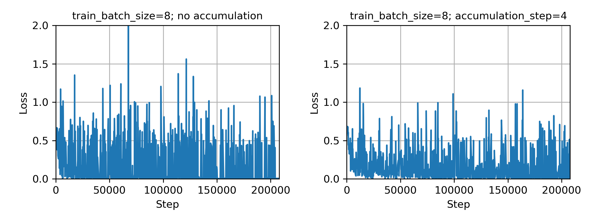

# Gradient Accumulation on tf.estimator

[`tf.estimator`](https://www.tensorflow.org/guide/estimator) is a high level TensorFlow API, that encapsulates training, evaluation, prediction, export for serving, to provide easy configurations for training, evaluation of a variety of model architectures in different computing infrastructures.

Gradient accumulation can provide a work around to OOM (out of memory) issue, often encountered while training using a *cheap* GPU, by using a smaller batch size that fits within the GPU's memory (including the overhead needed for the gradient accumulation implementation).

Since `tf.estimator` hides `tf.Graph` or `tf.Session` from the user, in order to operate on the gradients within `tf.estimator` framework, we need to modify the *train_op*. Using `tf.cond`, the train_op either updates the weights of the model (ie. `apply_gradients` on the accumulated gradients), when the `global_step` is an integer multiple of the number of batches we want the gradients to accumulate over, or else simply accumulates the gradients without weight updates.

## Fine-tuning BERT
### CoLA task on pretrained BERT-Small using GTX1050Ti

It is recommended to use `train_batch-size` of 32. However I can only fit 8 samples within 4GB of GTX1050Ti with pretrained BERT-Small model. Using gradient accumulation, I am still feeding in 8 samples per batch, but accumulating the gradients over 4 steps (to mimic train_batch_size of 32). This results in less noisy loss convergence (as compared to that when using `train_batch_size=8` without accumulation).

The *train_op* is in the `create_optimizer` function in [`optimization.py`](https://github.com/google-research/bert/blob/eedf5716ce1268e56f0a50264a88cafad334ac61/optimization.py) of [BERT](https://github.com/google-research/bert/commit/eedf5716ce1268e56f0a50264a88cafad334ac61).

Here are the changes for the gradient accumulation implementation:
* I hard-code `gradient_accumulation_multiplier=4`, since I am running `--train-batch-size=8` to mimic the recommended batch-size of 32. `gradient_accumulation_multiplier` is the number of batches over which the gradients are accumulated.
* `accum_grads` is the variable holding the accumulated gradients (ie. this is the memory overhead for doing gradient accumulation).
* If the `global_step` is an integer multiple of `gradient_accumulation_multiplier`, then we do `apply_accumulated_gradients`, otherwise we simply accumulate the gradients using `tf.assign_add`.
* We divide the accumulated gradients by `gradient_accumulation_multiplier` before calling `optimizer.apply_gradients`, and we zero out `accum_grads` after that.
* Gradient clipping is done to the accumulated gradient right before `apply_gradients`.


```
@@ -71,10 +71,30 @@ def create_optimizer(loss, init_lr, num_train_steps, num_warmup_steps, use_tpu):
   grads = tf.gradients(loss, tvars)
 
   # This is how the model was pre-trained.
-  (grads, _) = tf.clip_by_global_norm(grads, clip_norm=1.0)
-
-  train_op = optimizer.apply_gradients(
-      zip(grads, tvars), global_step=global_step)
+
+  gradient_accumulation_multiplier= 4
+  global_steps_int = tf.cast(global_step, tf.int32)
+  accum_grads = [tf.Variable(tf.zeros_like(t_var.initialized_value()), trainable=False) for t_var in tvars]
+
+  def apply_accumulated_gradients(accum_grads, grads, tvars):
+    accum_op= tf.group([accum_grad.assign_add(grad) for (accum_grad, grad) in zip(accum_grads, grads)])
+    with tf.control_dependencies([accum_op]):
+      normalized_accum_grads = [1.0*accum_grad/gradient_accumulation_multiplier for accum_grad in accum_grads]
+      (clippedNormalized_accum_grads, _) = tf.clip_by_global_norm(normalized_accum_grads, clip_norm=1.0)
+      minimize_op= optimizer.apply_gradients(zip(clippedNormalized_accum_grads, tvars), global_step = global_step)
+      with tf.control_dependencies([minimize_op]):
+        zero_op= tf.group([accum_grad.assign(tf.zeros_like(accum_grad)) for accum_grad in accum_grads])
+    return zero_op
+
+  # Create training operation
+  train_op = tf.cond(tf.math.equal(global_steps_int % gradient_accumulation_multiplier, 0),
+    lambda: apply_accumulated_gradients(accum_grads, grads, tvars),
+    lambda: tf.group([accum_grad.assign_add(grad) for (accum_grad, grad) in zip(accum_grads, grads)])
+  )
+
 
   # Normally the global step update is done inside of `apply_gradients`.
   # However, `AdamWeightDecayOptimizer` doesn't do this. But if you use
```

## Testing
Running on GTX1050Ti
### Dataset:
* [Yelp Review Polarity](https://www.tensorflow.org/datasets/catalog/yelp_polarity_reviews) has 560000 in `train.csv` and 38000 in `test.csv`

Splitting 0.99 to 0.01 of the `train.csv` to train and dev set, we have 554400 in the `train.tsv` going into BERT fine-tuning.

### BERT pretrained model:
* [BERT-Small](https://storage.googleapis.com/bert_models/2020_02_20/uncased_L-4_H-512_A-8.zip)

 We ran BERT-Small fine-tuning without and with the gradient accumulation modification to `optimization.py`

```
python bert/run_classifier.py  --task_name=cola  --do_train=true  --do_eval=true  --do_predict=true  --data_dir=./data/ --vocab_file=./uncased_L-4_H-512_A-8/vocab.txt  --bert_config_file=./uncased_L-4_H-512_A-8/bert_config.json  --init_checkpoint=./uncased_L-4_H-512_A-8/bert_model.ckpt --max_seq_length=128 --train_batch_size=8 --learning_rate=2e-5 --num_train_epochs=3.0 --output_dir=./output/ --do_lower_case=True
```

With `--train_batch_size=8 --num_train_epochs=3.0` and 554400 in `train.tsv`, we have a total of training steps: 554400*3/8=207900


We can see that the loss convergence is less noisy as expected (ie. the loss is mainly within 0.5 with the gradient accumulation vs higher or noisier otherwise).

## Another example
Typical `tf.estimator` workflow involves specifying `model_fn`, which returns the ops necessary to perform training, evaluation, or predictions. This example is based on [01_Regression/09 - TF Regression Example - Housing Price Estimation + Keras.ipynb](https://github.com/GoogleCloudPlatform/tf-estimator-tutorials/blob/ed1d56c08606478f012c67ef9a1fd78d90938512/01_Regression/09%20-%20TF%20Regression%20Example%20-%20Housing%20Price%20Estimation%20%2B%20Keras.ipynb) from [GCP/tf-estimator-tutorial](https://github.com/GoogleCloudPlatform/tf-estimator-tutorials/commit/ed1d56c08606478f012c67ef9a1fd78d90938512). Applying gradient accumulation in this example is practically not helpful, since the graph does not consume a lot of memory. However, I hope this example illustrates the steps for modifications of a typical *train_op*, which usually consists of a one-liner: `optimizer.minimize`.

The `_train_op_fn` modifications are as follow: (vs [01_Regression/09 - TF Regression Example - Housing Price Estimation + Keras.ipynb](https://github.com/GoogleCloudPlatform/tf-estimator-tutorials/blob/ed1d56c08606478f012c67ef9a1fd78d90938512/01_Regression/09%20-%20TF%20Regression%20Example%20-%20Housing%20Price%20Estimation%20%2B%20Keras.ipynb).  It is defined inside `model_fn` function.) Please see the complete file: [`another-example.py`](another-example.py).

* First, we get a handle of the `global_step`, which will be used in the `tf.cond` in the *train_op*. 
* `accum_grads` is the variable to accumulate the gradients
* If the `global_step` is an integer multiple of `gradient_accumulation_multiplier`, then we do `apply_accumulated_gradients`, otherwise we simply accumulate the gradients. We divide the accumulated gradients by `gradient_accumulation_multiplier` before calling `optimizer.apply_gradients`, and we zero out `accum_grads` after that.
* `global_step` is not incremented inside `optimizer.apply_gradients`. It is incremented outside, for both branches of the `tf.cond` of the *train_op*.


```
def _train_op_fn(loss):
    """Returns the op to optimize the loss."""

    global_step = tf.train.get_global_step()

    tvars = tf.trainable_variables()
    grads = tf.gradients(loss, tvars)
    accum_grads = [tf.Variable(tf.zeros_like(t_var.initialized_value()), trainable=False) for t_var in tvars]

    optimizer = tf.train.AdamOptimizer()

    def apply_accumulated_gradients(accum_grads, grads, tvars):
        accum_op= tf.group([accum_grad.assign_add(grad) for (accum_grad, grad) in zip(accum_grads, grads)])
        with tf.control_dependencies([accum_op]):
            normalized_accum_grads = [1.0*accum_grad/gradient_accumulation_multiplier for accum_grad in accum_grads]
            # global_step is not incremented inside optimizer.apply_gradients
            minimize_op= optimizer.apply_gradients(zip(normalized_accum_grads, tvars), global_step = None)
            with tf.control_dependencies([minimize_op]):
                zero_op= tf.group([accum_grad.assign(tf.zeros_like(accum_grad)) for accum_grad in accum_grads])
        return zero_op

    # Create training operation
    train_op = tf.cond(tf.math.equal(global_step % gradient_accumulation_multiplier, 0),
        lambda: apply_accumulated_gradients(accum_grads, grads, tvars),
        lambda: tf.group([accum_grad.assign_add(grad) for (accum_grad, grad) in zip(accum_grads, grads)])
    )

    # global_step is incremented here, regardless of the tf.cond branch
    train_op = tf.group(train_op, [tf.assign_add(global_step, 1)])
    return train_op
```
